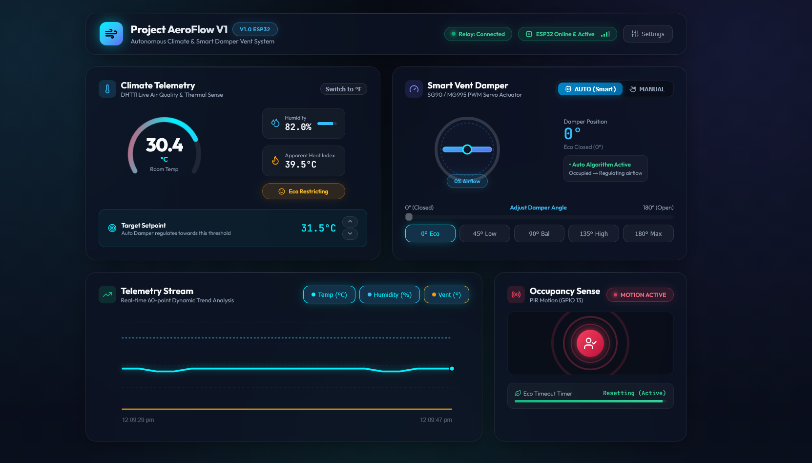
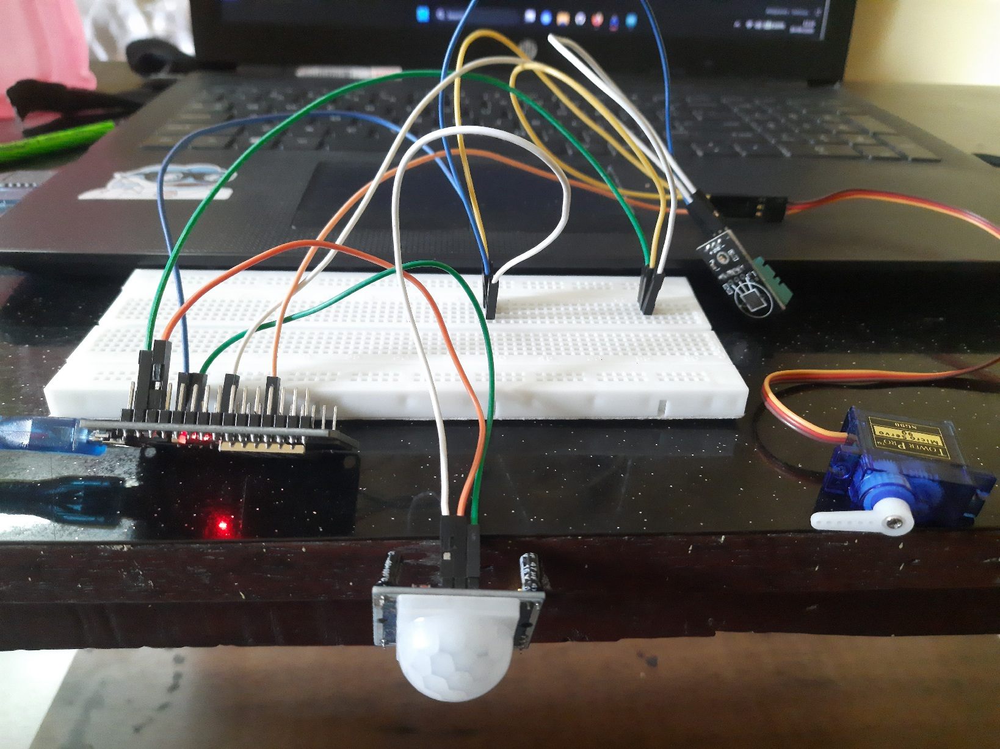

# ⚡ ESP32 IoT & Embedded Systems Repo

A collection of end-to-end IoT, smart home automation, and embedded robotics projects built with the **ESP32 microcontroller**, sensors, actuators, WebSocket real-time relays, and modern web dashboards.

> *Disclaimer: Developed with the assistance of Antigravity AI IDE.*

---

## 🚀 Projects Showcase

### 1. 🌬️ Project AeroFlow V1 • Smart HVAC & Vent Damper System
> **Directory**: [`smart-hvac-system/`](./smart-hvac-system/) • **Status**: Complete & Tested ✅

An autonomous climate control and motorized damper system that dynamically regulates airflow based on room occupancy (PIR) and ambient temperature/humidity (DHT11), backed by a Node.js WebSocket hub and a real-time web dashboard.

  
  

  <i>Left: Hardware Architecture & Wiring Diagram • Right: Real-Life (IRL) Prototype Setup</i>

#### Key Features:
- **Dual-Mode Operation**: Autonomous smart climate regulation & manual degree slider control ($0^\circ$–$180^\circ$).
- **Zero Microcontroller Lag**: ESP32 handles lightweight JSON telemetry over WebSocket while the Node.js server relays data to web dashboards.
- **Eco Energy Saver**: Automatically throttles the damper when room is unoccupied.

#### Hardware Pinout (V1):
| Component | ESP32 Pin | Function |
| :--- | :--- | :--- |
| **DHT11 Sensor** | `GPIO 4` | Temperature & Humidity Data |
| **PIR Motion Sensor** | `GPIO 13` | Human Presence Detection |
| **SG90 Micro Servo** | `GPIO 18` | PWM Damper Blade Actuator |

---

### 2. 🔬 Standalone Prototypes & Experiments - Foundation Directory
Quick standalone firmware modules for testing individual sensors and actuators:

- **[`Motion.ino`](./Motion.ino)**: Standalone PIR motion monitor with an embedded HTTP status server.
- **[`ServoControl.ino`](./ServoControl.ino)**: Standalone SG90 servo tester with a built-in web button interface.

---

## 🛠️ General Prerequisites & Setup

1. **Hardware**: ESP32 Development Board (ESP-WROOM-32 / ESP32 Dev Module), Micro-USB cable, 5V power source.
2. **Software**:
   - [Arduino IDE 2.x](https://www.arduino.cc/en/software) with the ESP32 Board Package installed.
   - [Node.js (v18+)](https://nodejs.org/) for projects featuring WebSocket relay servers and web clients.
